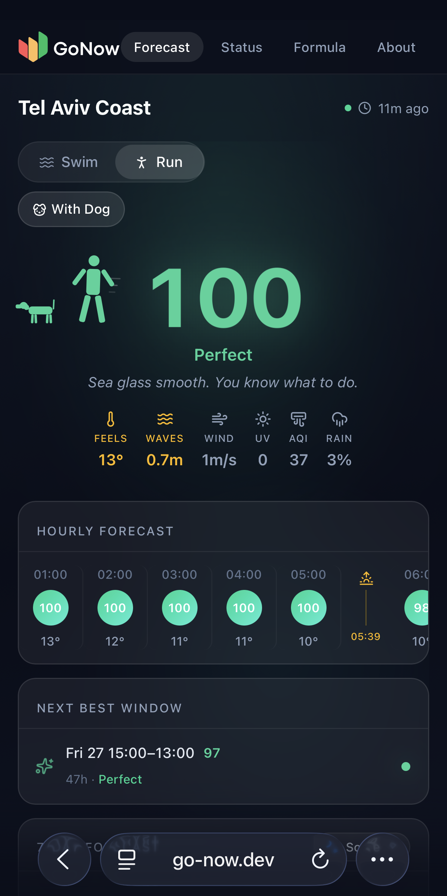
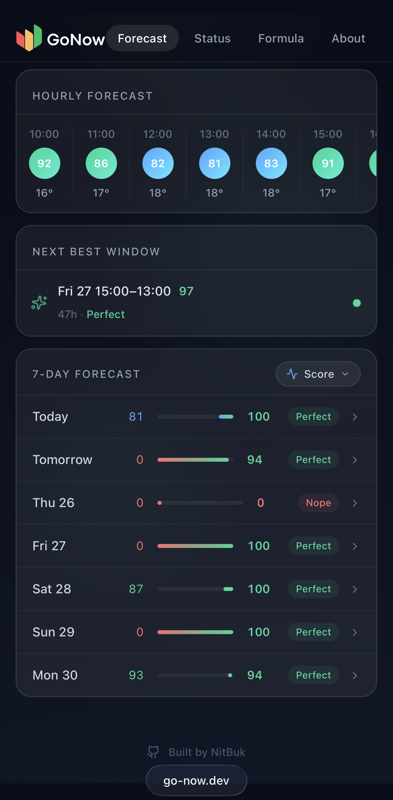
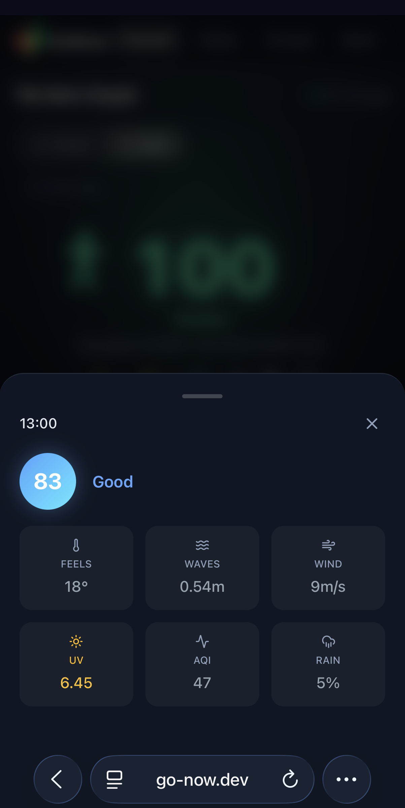
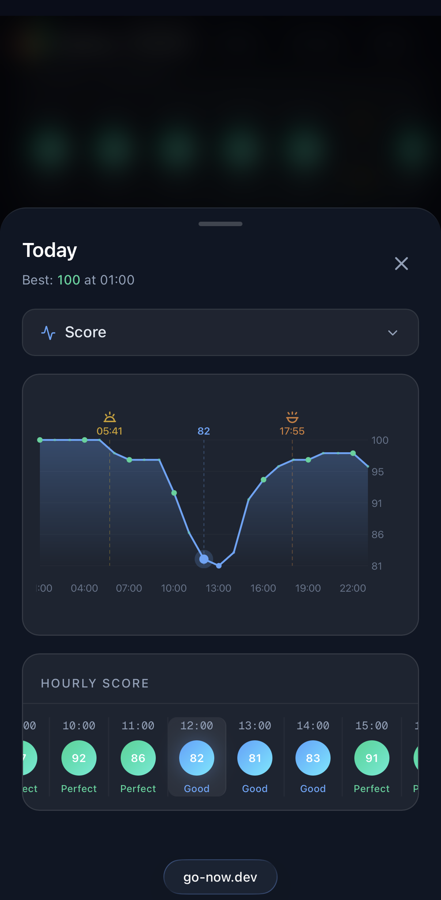
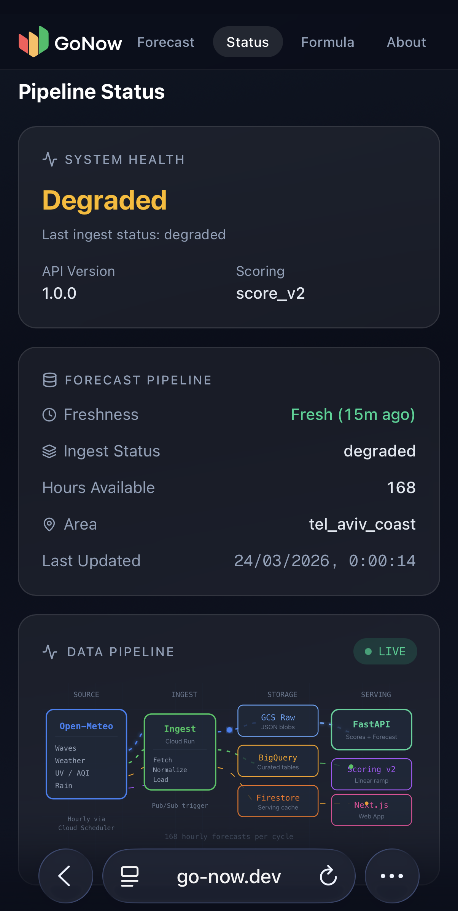

# Go Now

**Open-source outdoor activity scoring platform.** Combines wave, weather, UV, air quality, and rain data into a single 0-100 score per activity -- so you know whether to go outside without checking four different apps. Built end-to-end: an hourly data pipeline, a standalone Python scoring library, a REST API, and a mobile-first web app.

[](https://go-now.dev) [](https://github.com/NitBuk/go-now/actions/workflows/ci-api.yml) [](LICENSE) [](https://python.org) [](https://nextjs.org)

<p align="center">
  
  &nbsp;&nbsp;
  
  &nbsp;&nbsp;
  
</p>

> Tel Aviv coast is the first live deployment. The scoring engine is location-agnostic and runs as a standalone Python package with zero cloud dependencies.

---

## Try It

**Live:** [go-now.dev](https://go-now.dev)

**Run locally** (connects to the live API -- no GCP account needed):

```bash
git clone https://github.com/NitBuk/go-now.git
cd go-now/apps/dashboard_nextjs
npm install && npm run dev
```

Open [localhost:3000](http://localhost:3000). That's it.

**Use the scoring engine standalone** (pure Python, no cloud, no UI):

```bash
cd services/scoring_engine
uv run pytest tests/ -v   # 40+ tests, no setup needed
```

Or install as a package and call `score_hour()` directly. See [`services/scoring_engine/README.md`](services/scoring_engine/README.md).

---

## Features

- **4 activity modes** -- swim solo, swim with dog, run solo, run with dog, each scored 0-100
- **Multi-factor scoring** -- wave height, UV index, air quality (AQI), heat index, wind speed, rain probability, sunset time
- **Dog-aware** -- stricter thresholds for dog modes (dogs overheat faster and can't tell you)
- **Reason chips** -- 2-5 human-readable explanations per score ("High UV -15pt", "Calm Waves +0")
- **Hourly resolution** -- 7-day forecast, updated every hour from Open-Meteo (free, no API key)
- **Standalone scoring engine** -- pure Python package, no cloud deps, install and use anywhere
- **Serverless** -- runs on GCP Cloud Run, fits entirely within free tier

---

## How Scoring Works

Each hour starts at 100 and loses points per environmental factor. Hard gates (heavy rain, extreme wind, dangerous heat for dogs) can drop a score straight to 0.

| Score | Label | Meaning |
|-------|-------|---------|
| 85-100 | Perfect | Go. |
| 70-84 | Good | Good conditions, minor trade-offs |
| 45-69 | Meh | Possible but not ideal |
| 20-44 | Bad | Conditions are against you |
| 0-19 | Nope | Stay home |

Dog modes apply 1.2x multipliers on heat, AQI, and UV penalties. Swim scores drop to 0 after sunset. Full scoring logic: [`docs/04_scoring_engine_v1.md`](docs/04_scoring_engine_v1.md).

<p align="center">
  
</p>

---

## Architecture

```
Open-Meteo API (free, no key)
        |
Cloud Scheduler (hourly)
        |
        v
   Pub/Sub topic
        |
        v
+------------------+
|  Ingest Worker   |  Cloud Run (Python)
+--+-------+----+--+
   |       |    |
   v       v    v
 Cloud   Big   Firestore
Storage  Query (serving cache)
 (raw) (analytics)
                |
        +-------v--------+
        |  FastAPI (API)  |  Cloud Run
        +---+--------+---+
            |        |
   /v1/public/    /v1/public/
    scores         health
            |
    +-------v---------+
    |  Next.js Web    |  go-now.dev
    +-----------------+
```

**Key decisions:**
- Scoring engine is a standalone Python package -- no GCP deps, tested in isolation, and designed to port to Dart for V2 on-device scoring
- Three storage layers: raw archive (Cloud Storage), analytics (BigQuery), serving cache (Firestore) -- each optimized for a distinct access pattern
- Cloud Run scale-to-zero fits the hourly pipeline cadence; the full stack runs within GCP free tier
- `ForecastProvider` interface decouples data ingestion from scoring -- add a new weather source without touching the API or scoring logic

The `/status` page exposes pipeline health and a live architecture diagram:

<p align="center">
  
</p>

---

## Project Structure

```
apps/
  dashboard_nextjs/        # Next.js web app (mobile-first, Tailwind, Framer Motion)
  mobile_flutter/          # Flutter native app (V2, not yet started)

services/
  api_fastapi/             # FastAPI on Cloud Run (public endpoints)
  ingest_worker/           # Data pipeline (fetch, normalize, load)
  scoring_engine/          # Standalone scoring package (zero cloud deps)
  shared_contracts/        # Shared DTOs across services

docs/                      # 14 specification documents
infra/                     # GCP bootstrap notes, schemas, IAM configs
scripts/                   # Operational runbooks (diagnose-ingest.sh)
```

---

<details>
<summary><strong>Full Stack Setup (requires GCP account)</strong></summary>

Running the full stack locally requires a GCP project. For frontend-only dev, use the [Quick Start](#try-it) above.

### Prerequisites

- GCP account with a project created
- `gcloud` CLI authenticated (`gcloud auth application-default login`)
- Python 3.11+ with [uv](https://docs.astral.sh/uv/)
- Node.js 20+

### Steps

**1. Clone the repo**

```bash
git clone https://github.com/NitBuk/go-now.git
cd go-now
```

**2. Configure the ingest worker**

```bash
cp services/ingest_worker/.env.example services/ingest_worker/.env
# Edit .env -- set GOOGLE_CLOUD_PROJECT to your project ID
```

**3. Configure the API**

```bash
cp services/api_fastapi/.env.example services/api_fastapi/.env
# Edit .env -- set GOOGLE_CLOUD_PROJECT, remove FIRESTORE_EMULATOR_HOST for real Firestore
```

**4. Enable GCP APIs**

```bash
gcloud services enable firestore.googleapis.com \
  bigquery.googleapis.com \
  storage.googleapis.com \
  pubsub.googleapis.com
```

**5. Create a service account**

```bash
gcloud iam service-accounts create gonow-local \
  --display-name="Go Now Local Dev"

PROJECT_ID=$(gcloud config get-value project)
SA="gonow-local@${PROJECT_ID}.iam.gserviceaccount.com"

gcloud projects add-iam-policy-binding $PROJECT_ID --member="serviceAccount:$SA" --role="roles/datastore.user"
gcloud projects add-iam-policy-binding $PROJECT_ID --member="serviceAccount:$SA" --role="roles/bigquery.dataEditor"
gcloud projects add-iam-policy-binding $PROJECT_ID --member="serviceAccount:$SA" --role="roles/bigquery.jobUser"
gcloud projects add-iam-policy-binding $PROJECT_ID --member="serviceAccount:$SA" --role="roles/storage.objectAdmin"

gcloud iam service-accounts keys create ~/gonow-key.json --iam-account=$SA
export GOOGLE_APPLICATION_CREDENTIALS=~/gonow-key.json
```

**6. Create GCP resources**

```bash
gsutil mb gs://your-project-raw
bq mk gonow_v1
gcloud firestore databases create --region=europe-west1
```

Update your `.env` files to match the resource names you created.

**7. Run the ingest worker once to populate data**

```bash
cd services/ingest_worker
uv sync
uv run python -m src.main
```

**8. Start the API**

```bash
cd services/api_fastapi
uv sync
uv run uvicorn src.main:app --reload --port 8080
```

**9. Start the frontend**

```bash
cd apps/dashboard_nextjs
npm install
cp .env.example .env.local
npm run dev
```

Open [localhost:3000](http://localhost:3000).

</details>

---

## Running Tests

```bash
# Scoring engine (no GCP deps)
cd services/scoring_engine && uv run pytest tests/ -v

# API tests
cd services/api_fastapi && uv run pytest tests/ -v

# Ingest worker tests
cd services/ingest_worker && uv run pytest tests/ -v
```

---

## CI/CD

Four independent GitHub Actions pipelines, path-filtered so only the affected service runs on each push.

| Pipeline | Trigger | PR | Push to main |
|----------|---------|-----|-------------|
| API | `services/api_fastapi/**`, `services/scoring_engine/**` | lint + test | + build + deploy |
| Dashboard | `apps/dashboard_nextjs/**` | lint + build | + deploy |
| Ingest | `services/ingest_worker/**` | lint + test | + build + deploy |
| Scoring | `services/scoring_engine/**` | lint + test | test only (library) |

Deploys use keyless auth via [Workload Identity Federation](https://cloud.google.com/iam/docs/workload-identity-federation) -- no service account keys in GitHub.

---

## Roadmap

- [ ] Multi-location support (scoring engine is already location-agnostic)
- [ ] Flutter mobile app with on-device scoring (scoring engine designed for portability)
- [ ] User preference presets (Chill / Balanced / Strict)
- [ ] Additional activity types (cycling, hiking, sailing)
- [ ] Additional data providers beyond Open-Meteo
- [ ] Push notifications for optimal windows
- [ ] Docker Compose for full-stack local dev

---

## Contributing

Contributions welcome. See [CONTRIBUTING.md](CONTRIBUTING.md) for setup and guidelines.

Good first issues are labeled [`good first issue`](https://github.com/NitBuk/go-now/labels/good%20first%20issue).

See [CHANGELOG.md](CHANGELOG.md) for version history.

---

## Background

Before Go Now, every coastal trip started the same way: four apps, one decision. Check the weather, pull up the surf report, look up the UV index, open an air quality dashboard. Then try to mentally combine all of it -- is 1.2m swell too rough? Is AQI 80 acceptable? Is UV high enough to skip it?

Bringing a dog made it worse. Dogs overheat faster, are more sensitive to air quality, and can't tell you when they've had enough.

Go Now pulls wave, weather, UV, AQI, wind, and rain data every hour and runs it through a scoring engine. The result: a single number per activity. 85+ means go. Below 45, stay home. No tab-switching, no mental math.

---

## License

[MIT](LICENSE)
