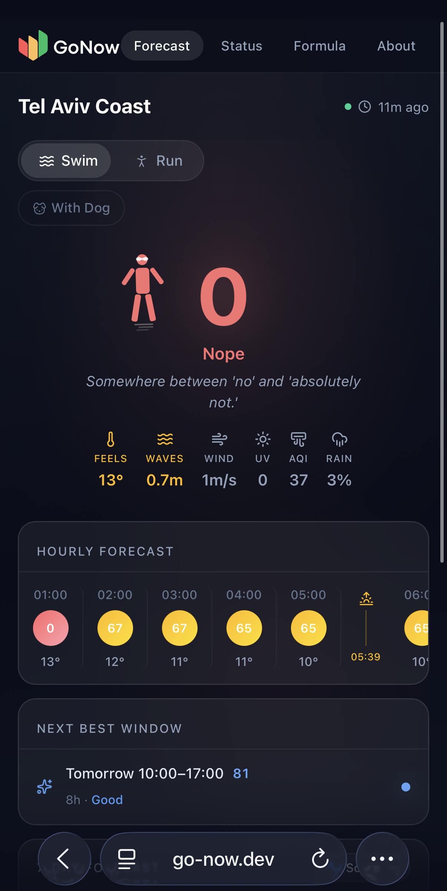

# Go Now - Web App

Next.js web app for the Go Now outdoor activity scoring platform. Displays 0-100 activity scores (swim, run, dog modes) fetched from the live API -- Tel Aviv coast is the current active location.

## Stack

- **Next.js 16** with App Router
- **React 19**
- **Tailwind CSS 4**
- **TypeScript 5**

## Dev Setup

```bash
npm install
npm run dev
```

Open [http://localhost:3000](http://localhost:3000).

## Environment

| Variable | Description |
|---|---|
| `NEXT_PUBLIC_API_URL` | API base URL. Defaults to `http://localhost:8080` if not set. |

Copy `.env.example` to `.env.local` and adjust as needed:

```bash
cp .env.example .env.local
```

For frontend-only development (no local API), point at the live API by leaving the default value in `.env.example` as-is.

## Pages

| Route | Description |
|---|---|
| `/` | Forecast page - scores, timeline, best windows |
| `/status` | Pipeline health + architecture overview |

<p align="center">
  
</p>

## Full Setup

See the [root README](../../README.md) for full local stack setup including the API and ingest worker.
