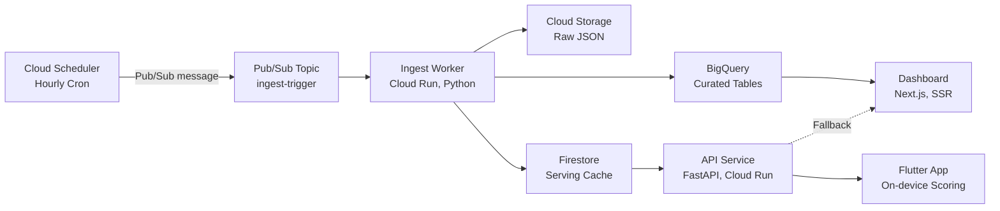

# Public Dashboard Spec (Next.js)

## Goal

A public, portfolio-ready dashboard that showcases the Go Now data engineering pipeline. The dashboard demonstrates real-time data ingestion, quality monitoring, and forecast visualization for the Tel Aviv coast. It serves as a credibility piece for data engineering work — recruiters and peers can see a live, functioning pipeline with observability built in.

## Audience

Recruiters, peers, and portfolio visitors. The dashboard must be self-explanatory without requiring login or context about the mobile app.

## Tech Stack

| Layer | Choice | Rationale |
|-------|--------|-----------|
| Framework | Next.js (App Router) | SSR + ISR for fast loads, good SEO |
| Language | TypeScript | Type safety, shared contracts |
| Charting | Recharts | React-native, lightweight, good SSR support |
| Styling | Tailwind CSS | Utility-first, fast iteration |
| Hosting | Firebase Hosting or Cloud Run | Serverless, low cost |

## Data Fetching Strategy

### Server-Side Rendering from BigQuery

All data-heavy pages (Status, Forecast Explorer, Data Quality) fetch from BigQuery at render time using a service account. The dashboard server has read-only access to `hourly_forecast_v1` and `ingest_runs_v1` tables. No client-side BigQuery access is ever exposed.

### Incremental Static Regeneration (ISR)

Pages use ISR with a **5-minute revalidation** interval. This means:
- First visitor after 5 minutes triggers a background re-render.
- Subsequent visitors get the cached page until the next revalidation.
- Balances freshness (pipeline updates hourly) with cost (minimal BigQuery reads).

### Client-Side API Fallback

Each page includes a "Refresh" button that triggers client-side calls to the FastAPI service:
- `/v1/public/health` — for pipeline status and freshness.
- `/v1/public/forecast` — for current forecast data.

This provides a fallback if BigQuery reads are slow or if the user wants the latest data without waiting for ISR.

### Data Flow Summary

```
BigQuery (hourly_forecast_v1, ingest_runs_v1)
  └─ SSR at build/revalidation time (service account)
       └─ Next.js page (ISR, 5-min revalidation)
            └─ Client browser
                 └─ Optional: "Refresh" button → FastAPI /v1/public/health, /v1/public/forecast
```

## Pages

### Page 1: Home / Status

The landing page. Shows at a glance whether the pipeline is healthy and what conditions look like right now.

#### Hero Section

- Title: **"Go Now Pipeline Status"**
- Subtitle: "Real-time data ingestion for Tel Aviv coast conditions"
- Real-time freshness indicator badge next to the title (green/yellow/red dot with text)

#### Pipeline Status Card

A prominent card displaying:

| Field | Source | Display |
|-------|--------|---------|
| Last ingest time | `ingest_runs_v1.finished_at_utc` (latest row) | "Last updated: 12:05 PM (8 min ago)" |
| Ingest status | `ingest_runs_v1.status` (latest row) | Badge: "Success" (green), "Degraded" (yellow), "Failed" (red) |
| Provider latency | `ingest_runs_v1.finished_at_utc - started_at_utc` (latest row) | "Provider response: 1.2s" |
| Hours ingested | `ingest_runs_v1.hours_count` (latest row) | "168/168 hours" |
| DQ flags | `ingest_runs_v1.dq_flags` (latest row) | List of flags if any, or "No issues" |

#### Freshness Gauge

A visual gauge (circular or horizontal bar) indicating forecast freshness:

| Age | Color | Label |
|-----|-------|-------|
| < 60 minutes | Green | "Fresh" |
| 60–90 minutes | Yellow | "Aging" |
| > 90 minutes | Red | "Stale" |

Computed from: `now() - ingest_runs_v1.finished_at_utc` (latest successful run).

#### Ingest Success Rate (24h Sparkline)

A mini sparkline chart showing the last 24 ingest runs (one per hour). Each point is colored:
- Green dot: `status = success`
- Yellow dot: `status = degraded`
- Red dot: `status = failed`
- Gray dot: missing (no run recorded for that hour)

Displays overall rate as text: "23/24 successful (96%)".

#### Current Conditions Snapshot

A row of 4 compact metric cards showing the current hour's data from the forecast:

| Metric | Field | Example | Unit |
|--------|-------|---------|------|
| Feels Like | `feelslike_c` | 28.5 | C |
| UV Index | `uv_index` | 6.2 | — |
| Air Quality | `eu_aqi` | 45 | EU AQI |
| Wave Height | `wave_height_m` | 0.4 | m |

Each card shows the value with a color indicator based on scoring thresholds (green if within "Good" range, yellow for "Meh", red for "Bad").

---

### Page 2: Forecast Explorer

Interactive time-series visualization of the 7-day hourly forecast.

#### Time-Series Charts

Four stacked charts, each showing 7 days of hourly data from `hourly_forecast_v1`:

| Chart | Field | Y-Axis Unit | Color |
|-------|-------|-------------|-------|
| Wave Height | `wave_height_m` | meters | Blue |
| Feels Like | `feelslike_c` | Celsius | Orange |
| UV Index | `uv_index` | UV index | Purple |
| Air Quality | `eu_aqi` | EU AQI | Green |

**Interactivity (Recharts):**
- Hover tooltip: shows exact value, timestamp, and unit for the hovered point.
- Zoom/pan: horizontal drag to zoom into a time range; pinch or scroll to zoom out.
- Responsive: charts stack vertically on mobile, side-by-side (2x2) on desktop.

#### Day Selector Tabs

A row of 7 day tabs (Today, Tomorrow, +2d, ..., +6d) above the charts. Selecting a tab:
- Scrolls/zooms the charts to that day's 24-hour window.
- Highlights the selected day's range with a subtle background band.
- "All 7 Days" tab shows the full range (default).

#### Score Heatmap

A 7-day x 24-hour grid showing computed scores for each activity mode. The grid is colored by score tier:

| Tier | Score Range | Color |
|------|-------------|-------|
| Perfect | 85–100 | Deep green |
| Good | 70–84 | Light green |
| Meh | 45–69 | Yellow |
| Bad | 20–44 | Orange |
| Nope | 0–19 | Red |

Mode selector: tabs or dropdown to switch between swim_solo, swim_dog, run_solo, run_dog.

**Note:** The dashboard computes scores using the **Balanced** preset thresholds (canonical defaults from `02_user_profile_schema.md`). This is a display-only approximation — personalized scores are computed on-device in the mobile app.

---

### Page 3: Data Quality

Pipeline observability page. Shows whether ingested data is complete and within expected ranges.

#### Missingness Summary

A table showing null rates per variable for the last 7 days:

| Variable | Total Hours | Null Count | Null % | Status |
|----------|-------------|------------|--------|--------|
| `wave_height_m` | 168 | 2 | 1.2% | OK |
| `feelslike_c` | 168 | 0 | 0.0% | OK |
| `uv_index` | 168 | 5 | 3.0% | OK |
| `eu_aqi` | 168 | 18 | 10.7% | Warning |
| ... | ... | ... | ... | ... |

Status thresholds:
- OK: null rate < 5%
- Warning: null rate 5–10%
- Critical: null rate > 10%

Data source: `SELECT` from `hourly_forecast_v1` for the last 7 days, counting nulls per column.

#### Range Check Violations

A summary card showing count of out-of-range values detected in the last 7 days, referencing the DQ check rules from `03_data_sources.md`:

| Variable | Valid Range | Violations (7d) | Example |
|----------|-------------|------------------|---------|
| `wave_height_m` | [0, 10] m | 0 | — |
| `eu_aqi` | [0, 500] | 1 | 612 at 2025-06-03T14:00Z |
| `uv_index` | [0, 15] | 0 | — |
| `feelslike_c` | [-5, 55] C | 0 | — |
| `wind_ms` | [0, 50] m/s | 0 | — |

#### DQ Flags Timeline

A horizontal timeline chart (Recharts bar or scatter) showing the last 30 days of ingest runs, colored by status:
- Green bars: `success`
- Yellow bars: `degraded`
- Red bars: `failed`
- Hovering shows: run_id, started_at, status, dq_flags array.

#### Recent Ingest Runs Table

A sortable, paginated table of recent ingest runs from `ingest_runs_v1`:

| Column | Description |
|--------|-------------|
| Run ID | `ingest_run_id` (truncated, with copy button) |
| Started | `started_at_utc` (local time format) |
| Finished | `finished_at_utc` (local time format) |
| Duration | `finished_at_utc - started_at_utc` |
| Status | Badge (success/degraded/failed) |
| Hours | `hours_count` / 168 |
| DQ Flags | Comma-separated list or "None" |
| Error | `error_message` (truncated, expandable) |

Default sort: most recent first. Shows last 50 runs with pagination.

---

### Page 4: Architecture

A static reference page explaining the pipeline design.

#### Pipeline Diagram

Render the architecture diagram using Mermaid (via `next-mdx-remote` or a Mermaid React component):



#### Component Descriptions

A card for each component with:

| Component | Tech Stack | Responsibility |
|-----------|-----------|----------------|
| Cloud Scheduler | GCP Managed Cron | Triggers hourly ingestion via Pub/Sub |
| Pub/Sub | GCP Messaging | Decouples scheduler from worker; enables retry |
| Ingest Worker | Python, Cloud Run | Fetches Open-Meteo APIs, normalizes, loads to 3 storage layers |
| Cloud Storage | GCS | Raw JSON archive for auditability and replay |
| BigQuery | GCP Analytics DB | Curated hourly data; dashboard reads; analytics |
| Firestore | GCP Document DB | Serving cache for API; user profiles |
| API Service | Python, FastAPI, Cloud Run | Public forecast + health endpoints; private profile endpoints |
| Flutter App | Dart, Flutter | Mobile client; on-device scoring engine |
| Dashboard | TypeScript, Next.js | Public pipeline monitoring; portfolio piece |

#### Data Flow Explanation

A written narrative (3–4 paragraphs) explaining:
1. How data flows from Open-Meteo through the three storage layers.
2. Why scoring runs on-device instead of on the backend.
3. How the dashboard reads from BigQuery (not Firestore) for richer analytics.
4. The cost model: single location, free-tier provider, serverless infrastructure.

## Responsive Design

Mobile-first design with three breakpoints:

| Breakpoint | Width | Layout |
|------------|-------|--------|
| Mobile | < 640px | Single column, stacked charts, collapsed tables |
| Tablet | 640px–1023px | Two-column grid for cards, wider charts |
| Desktop | >= 1024px | Full-width charts, side-by-side cards, expanded tables |

Charts resize responsively using Recharts' `ResponsiveContainer`. Tables switch to card-based layouts on mobile.

## SEO and Meta Tags

```html
<title>Go Now — Tel Aviv Coast Pipeline Status</title>
<meta name="description" content="Real-time data pipeline monitoring for Tel Aviv beach conditions. Wave height, weather, UV, and air quality — ingested hourly from Open-Meteo." />
<meta property="og:title" content="Go Now — Tel Aviv Coast Pipeline Status" />
<meta property="og:description" content="Real-time data pipeline monitoring for Tel Aviv beach conditions." />
<meta property="og:image" content="/og-status-card.png" />
<meta property="og:type" content="website" />
```

- **OpenGraph image:** Auto-generated status card showing current pipeline health, freshness, and conditions snapshot. Generated at build time or via an OG image API route (`/api/og`).
- **robots.txt:** Allow all crawlers. No restricted paths (dashboard is fully public).
- **Sitemap:** Auto-generated sitemap.xml with all 4 pages.

```
# robots.txt
User-agent: *
Allow: /

Sitemap: https://gonow.example.com/sitemap.xml
```

## Public Access and Security

- The dashboard is fully public. No authentication required.
- No secrets or user data are exposed.
- BigQuery access is server-side only (service account, never exposed to client).
- Only shared Tel Aviv forecast data and pipeline metadata are displayed.
- API fallback calls use public endpoints only (`/v1/public/health`, `/v1/public/forecast`).

## Directory Structure

```
apps/dashboard_nextjs/
├── app/
│   ├── layout.tsx              # Root layout, meta tags, navigation
│   ├── page.tsx                # Home / Status page
│   ├── forecast/
│   │   └── page.tsx            # Forecast Explorer page
│   ├── quality/
│   │   └── page.tsx            # Data Quality page
│   ├── architecture/
│   │   └── page.tsx            # Architecture page
│   ├── api/
│   │   └── og/
│   │       └── route.tsx       # OpenGraph image generation
│   └── sitemap.ts              # Auto-generated sitemap
├── components/
│   ├── StatusCard.tsx           # Pipeline status display
│   ├── FreshnessGauge.tsx       # Green/yellow/red freshness indicator
│   ├── IngestSparkline.tsx      # 24h ingest success sparkline
│   ├── ConditionsSnapshot.tsx   # Current hour metric cards
│   ├── TimeSeriesChart.tsx      # Recharts time-series wrapper
│   ├── DaySelector.tsx          # 7-day tab selector
│   ├── ScoreHeatmap.tsx         # 7d x 24h score grid
│   ├── MissingnessTable.tsx     # Null rate summary table
│   ├── RangeViolations.tsx      # Range check violations card
│   ├── DQTimeline.tsx           # DQ flags timeline chart
│   ├── IngestRunsTable.tsx      # Paginated ingest runs table
│   ├── ArchitectureDiagram.tsx  # Mermaid diagram renderer
│   └── Navigation.tsx           # Top nav bar with page links
├── lib/
│   ├── bigquery.ts              # BigQuery client (server-side only)
│   ├── api.ts                   # API client for fallback calls
│   ├── scoring.ts               # Balanced-preset score computation (display only)
│   └── types.ts                 # Shared TypeScript types
├── public/
│   ├── robots.txt
│   └── og-status-card.png       # Fallback OG image
├── .env.example
├── next.config.js
├── tailwind.config.js
├── tsconfig.json
└── package.json
```
